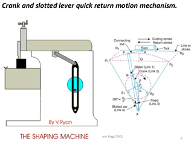
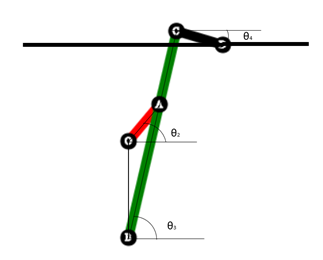
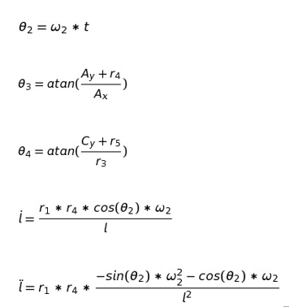
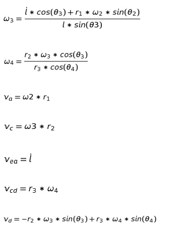
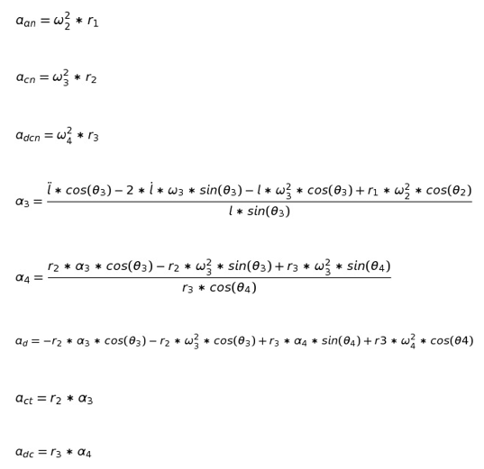
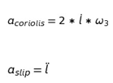

### OBJECTIVE:

After completing the experiments on kinematics of crank and slotted mechanism

- Students will be comfortable with working with basic six link mechanisms
- Students will be able to perform position, velocity and acceleration analysis on the crank and slotted mechanism.

### Prerequisites

- Knowledge of kinematic analysis of a 4 bar mechanism
- Knowledge of various kinds of links.
- Knowledge of velocity and acceleration analysis

### THEORY

The crank and slotted quick return mechanism converts rotatory motion into linear motion. It is extensively used in shaping and cutting machines and is particularly useful in cutting flat surfaces out of metal stock. The return stroke of the ram is faster than the advancing stroke. The mechanism consists of an arm attached to a rotating disc that moves at a controlled uniform speed. Unlike the crank, the arm of the mechanism runs at a different rate than the disc. By having the disc run at a different rate than the attached arm, productivity increases because the amount of time needed for a cut is reduced.

The crank and slotted quick return mechanism was invented by Whitworth in the 1800s. It played an active role in increasing productivity by reducing cutting times in shaping machines.

### Applications

As a quick return mechanism it finds applications in various fields. Its quick return action is used in shaping machines to reduce the total process time while its controlled forward action is used to give clean and defined cuts necessary for shaping. It also finds application in shaping machines, slotting machines, rotary internal combustion engines.

Ref:

### Mathematical Model

Fig 3

r1 = length of crank OA

r2 = length of the arm BC

r3 = length of ram arm CD

r4 = Distance between the centre of rotation of the crank and the line on which the ram oscillates

r5 = Length between centres of rotation O and B

l = Variable distance between point A and B

**Using vector loop formulation we get the following equations for all of the position, velocity and acceleration components of the mechanism**

#### Position Analysis

#### Velocity Analysis:

#### Acceleration Analysis:

Since there is a sliding link on a rotating arm, a Coriolis component of acceleration is present:

